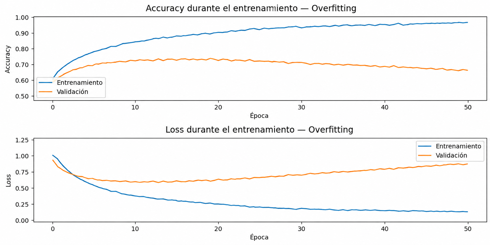
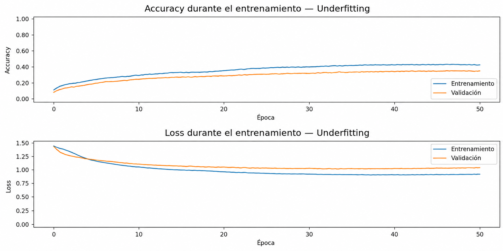

# Métricas para la Evaluación de Modelos de Machine Learning

## Propósito

Este documento presenta una guía breve para **seleccionar, comprender e interpretar métricas de evaluación** utilizadas en problemas de clasificación y regresión.

> **Idea clave:** no existe una métrica ni un valor universal que determine por sí solo si un modelo es “bueno”. La interpretación depende del problema, los datos, el *baseline*, el costo de los errores y el objetivo del proyecto.

---

## 1. Métricas principales

| Métrica | Tipo de problema | ¿Qué mide? — explicación sencilla | ¿Cómo interpretar el valor? | Ejemplo de interpretación |
|---|---|---|---|---|
| **Accuracy** | Clasificación | De todos los casos, ¿qué porcentaje clasificó correctamente el modelo? | **Mayor es mejor**, pero debe compararse con un *baseline* y considerar el balance de las clases. | `Accuracy = 0.65` significa que el modelo acertó aproximadamente el **65 %** de los casos. |
| **Precision** | Clasificación | De todos los casos que el modelo predijo como positivos, ¿cuántos realmente eran positivos? | **Mayor es mejor**. Es especialmente relevante cuando los **falsos positivos** son costosos. | `Precision = 0.80`: de cada 100 casos predichos como positivos, aproximadamente 80 eran realmente positivos. |
| **Recall** | Clasificación | De todos los positivos reales, ¿cuántos logró encontrar el modelo? | **Mayor es mejor**. Es especialmente relevante cuando es importante no dejar positivos sin detectar. | `Recall = 0.90`: el modelo encontró aproximadamente 90 de cada 100 positivos reales. |
| **F1-score** | Clasificación | Resume **Precision** y **Recall** en un único indicador. | **Mayor es mejor**. Es útil cuando se busca equilibrar Precision y Recall. | `F1 = 0.82` indica un equilibrio relativamente alto entre Precision y Recall. |
| **AUC-ROC** | Clasificación | Mide la capacidad del modelo para distinguir entre clases a diferentes umbrales de decisión. | En clasificación binaria, `0.5` representa una discriminación similar al azar y `1.0` una separación perfecta. **Mayor es mejor**. | `AUC = 0.85` indica una capacidad de discriminación relativamente alta. |
| **Loss** | Entrenamiento de modelos | Indica cuánto se está equivocando el modelo de acuerdo con la función de pérdida utilizada. Considera no solo si acertó, sino también cómo fueron sus predicciones. | En general, **menor es mejor**, pero **no existe un valor universal de Loss para aprobar un modelo**. Es especialmente útil observar su evolución en entrenamiento y validación. | Si `train_loss` disminuye mientras `val_loss` aumenta, puede existir **overfitting**. |
| **MAE** | Regresión | En promedio, ¿cuánto se alejan las predicciones del valor real? | **Menor es mejor**. Se expresa en las mismas unidades de la variable objetivo. | Si se predice ingreso y `MAE = $50.000`, el error absoluto promedio es aproximadamente $50.000. |
| **MSE** | Regresión | Mide el error elevando las diferencias al cuadrado, por lo que penaliza especialmente los errores grandes. | **Menor es mejor**. Su escala está al cuadrado respecto de la variable objetivo. | Dos modelos pueden tener errores habituales similares, pero el que cometa errores extremos tendrá un MSE mayor. |
| **RMSE** | Regresión | Resume el error del modelo penalizando especialmente los errores grandes, pero vuelve a las unidades originales de la variable objetivo. | **Menor es mejor**. Debe interpretarse considerando la escala de la variable objetivo. | `RMSE = 3.2` años significa un error típico aproximado de 3,2 años en una predicción de edad. |
| **R²** | Regresión | Indica qué proporción de la variabilidad de la variable objetivo es explicada por el modelo. | Generalmente **mayor es mejor**. `1` representa ajuste perfecto; `0` equivale aproximadamente a no mejorar respecto de predecir la media. Puede ser negativo. | `R² = 0.72` indica que el modelo explica aproximadamente el **72 %** de la variabilidad observada. |

---

## 2. Accuracy y Loss: una diferencia fundamental

Una forma sencilla de distinguir ambas medidas es:

> **Accuracy indica cuántas veces acertó el modelo.**  
> **Loss indica cuánto se equivocó el modelo según la función de pérdida utilizada.**

Supongamos un problema de clasificación donde la clase correcta es **Centro**:

| Predicción | ¿Acertó? | Lectura simplificada |
|---|---:|---|
| Centro: 90 % | Sí | Accuracy registra un acierto y el Loss debería ser relativamente bajo. |
| Centro: 40 % | Sí | Accuracy también registra un acierto, pero el modelo mostró menor seguridad; el Loss será mayor que en el caso anterior. |
| Derecha: 90 % | No | Accuracy registra un error y el Loss será alto porque el modelo se equivocó con mucha confianza. |

Por esta razón, **Accuracy y Loss no son métricas intercambiables**. Ambas aportan información diferente sobre el comportamiento de una red neuronal.

---

## 3. ¿Qué es un baseline?

Un **baseline** es un punto de comparación sencillo que permite determinar si el modelo realmente aporta capacidad predictiva.

En clasificación, una estrategia básica consiste en predecir siempre la **clase mayoritaria**.

Por ejemplo:

```text
Baseline = 36 %
Modelo   = 65 %
```

El modelo supera ampliamente el baseline. En cambio:

```text
Baseline = 36 %
Modelo   = 37 %
```

Aunque el modelo funciona técnicamente, su mejora respecto del punto de comparación es mínima.

> **Un modelo no debe evaluarse únicamente por su Accuracy; debe compararse con un punto de referencia apropiado.**

---

## 4. Cómo leer las curvas de aprendizaje de una red neuronal

Durante el entrenamiento de una red neuronal normalmente observamos dos conjuntos de datos:

- **Entrenamiento (train):** datos utilizados para ajustar los parámetros del modelo.
- **Validación (validation):** datos utilizados para observar cómo se comporta el modelo con casos que no está utilizando directamente para ajustar sus parámetros.

### Patrones frecuentes

| Comportamiento en entrenamiento | Comportamiento en validación | Posible interpretación |
|---|---|---|
| Accuracy aumenta | Accuracy aumenta | El modelo está aprendiendo y el desempeño también mejora en validación. |
| Loss disminuye | Loss disminuye | Comportamiento esperado durante un aprendizaje adecuado. |
| Accuracy aumenta | Accuracy disminuye o se estanca | Posible **overfitting**. |
| Loss disminuye | Loss aumenta | Evidencia característica de posible **overfitting**. |
| Accuracy permanece baja | Accuracy permanece baja | Posible **underfitting**: el modelo no está capturando suficientemente los patrones. |
| Train y validation presentan resultados similares | Resultados similares | Puede ser una buena señal de generalización, siempre que el desempeño sea adecuado. |

---

## 5. Overfitting y Underfitting en palabras sencillas

### Overfitting — sobreajuste

El modelo aprende demasiado específicamente los datos de entrenamiento y pierde capacidad para generalizar a datos nuevos.

Un patrón frecuente se observa en las siguientes curvas:



La red sigue mejorando sobre los datos que ya conoce, pero empeora o deja de mejorar frente a datos de validación.

### Underfitting — subajuste

El modelo todavía no logra aprender suficientemente los patrones presentes en los datos.

Un patrón frecuente se observa en las siguientes curvas:



En este caso puede ser necesario revisar la arquitectura, los hiperparámetros, las características utilizadas o el propio conjunto de datos.

---

## 6. Ejemplo completo de interpretación

Supongamos los siguientes resultados:

```text
Baseline:                36 %
Accuracy entrenamiento:  69 %
Accuracy validación:     64 %
Accuracy test:           65 %
```

A primera vista, el modelo supera claramente el baseline y alcanza un desempeño mayor al 60 %.

Sin embargo, las curvas muestran:

```text
Train Accuracy      → se mantiene o aumenta
Validation Accuracy → disminuye
Train Loss          → disminuye
Validation Loss     → aumenta
```

### Interpretación

El modelo presenta evidencia de **overfitting**. Está aprendiendo cada vez mejor los datos de entrenamiento, pero esa mejora no se traduce en un mejor desempeño sobre validación.

Por lo tanto, una conclusión adecuada sería:

> El modelo presenta un desempeño superior al baseline y alcanza un Accuracy aceptable para el ejercicio. Sin embargo, las curvas muestran una separación progresiva entre entrenamiento y validación. El Loss de entrenamiento disminuye mientras el Loss de validación aumenta, lo que constituye evidencia de sobreajuste. Un siguiente experimento debería modificar hiperparámetros con el objetivo de mejorar la capacidad de generalización.

---

## 7. ¿Qué métrica debería utilizar?

No existe una única respuesta. La selección depende de lo que sea importante en el problema.

| Si necesito... | Métrica que puede ser especialmente útil |
|---|---|
| Saber qué proporción total de casos clasifico correctamente | **Accuracy** |
| Evitar muchos falsos positivos | **Precision** |
| Detectar la mayor cantidad posible de positivos reales | **Recall** |
| Equilibrar Precision y Recall | **F1-score** |
| Evaluar capacidad de discriminación binaria a distintos umbrales | **AUC-ROC** |
| Observar cómo está aprendiendo una red neuronal | **Loss + métrica de desempeño** |
| Medir error promedio en las unidades originales | **MAE** |
| Penalizar especialmente errores grandes | **MSE / RMSE** |
| Analizar proporción de variabilidad explicada en regresión | **R²** |

---

## 8. Sobre los valores “aceptables”

> **No existe una Accuracy, F1, AUC, MAE, RMSE, R² o Loss universal que determine automáticamente que un modelo es adecuado.**

Un valor debe interpretarse considerando, entre otros elementos:

1. El **tipo de problema**.
2. El **baseline** disponible.
3. El balance o desbalance de las clases.
4. El costo de los distintos tipos de error.
5. La calidad y cantidad de datos.
6. El objetivo para el cual se utilizará el modelo.
7. La diferencia entre entrenamiento, validación y prueba.

### Criterio específico de la Evaluación 2

En la **Evaluación 2 del curso**, se utiliza:

> **Accuracy en test ≥ 60 %**

como un **umbral pedagógico específico para el ejercicio y el dataset utilizado**.

Este valor **no constituye una regla general de Machine Learning**.

Además, el modelo debe compararse con el **baseline** y deben interpretarse las curvas de **Accuracy y Loss**. Alcanzar el 60 % por sí solo no demuestra que el entrenamiento sea óptimo ni que no exista overfitting.

---

## 9. Regla práctica para interpretar un modelo

Antes de concluir que un modelo funciona adecuadamente, pregúntese:

1. **¿Supera el baseline?**
2. **¿Alcanza un desempeño adecuado para el objetivo del problema?**
3. **¿Entrenamiento y validación muestran un comportamiento coherente?**
4. **¿Existe evidencia de overfitting o underfitting?**
5. **¿El desempeño se mantiene sobre el conjunto de test?**
6. **¿La métrica utilizada es apropiada para el tipo de problema?**

La evaluación de un modelo no consiste únicamente en obtener un número alto. Consiste en **interpretar evidencia y justificar técnicamente las decisiones tomadas**.
